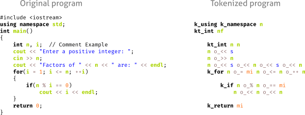
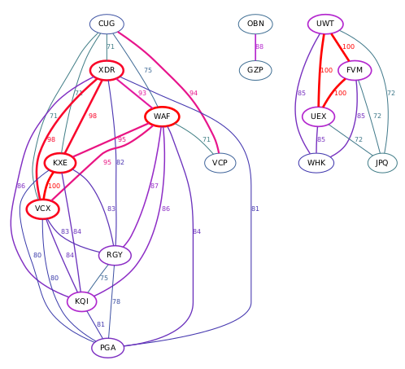
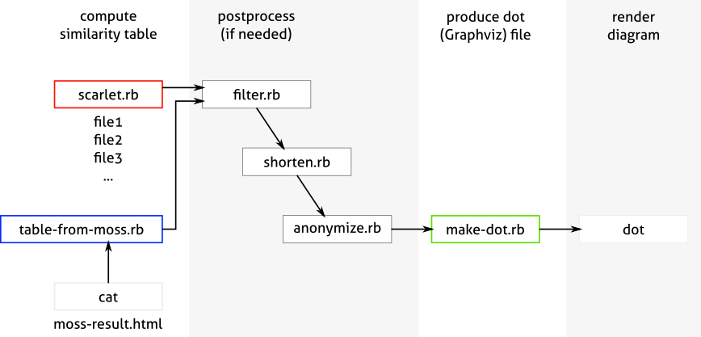
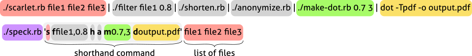

# Study in Scarlet

**Study in Scarlet** is a simple Unix-friendly toolkit for plagiarism detection.

The program is based on the idea is to use lexers from the code highlighter [Rouge](https://github.com/rouge-ruby/rouge) 
to convert each source code file into a sequence of tokens (while removing variable names, comments, 
and superfluous punctuation):

After that, we run a similarity checker (a modified version of [Sherlock](https://github.com/ag-gipp/sherlock)) 
on these tokenized files to assess how similar they are.

## Usage demo

**(Also see a more in-depth tutorial in the subfolder `./example/`)**
    
To compute the similarity between all C++ programs in the current folder: 

    ./scarlet.rb *.cpp 

The output will look like this (the similarity score, shown in the third column is a number between 0=different and 1=identical):

    prog1.cpp prog2.cpp 0.129296
    prog1.cpp prog3.cpp 0.03125
    prog1.cpp prog4.cpp 0.048062
    prog1.cpp prog5.cpp 0.129296
    prog1.cpp prog6.cpp 0.0753221
    prog2.cpp prog3.cpp 0.071256
    prog2.cpp prog4.cpp 0.100437
    ...

If compute the same similarity, and then shorten all filenames in the output, anonymized them, and draw a diagram with Graphviz, 
displaying only pairs with similarity >= 0.7:

    ./scarlet.rb *.cpp | ./shorten.rb | ./anonymize.rb | ./make-dot.rb 0.7 | dot -Tpdf -o out.pdf

The produced diagram will look like this:

Using the script `./table-from-moss.rb`, we can parse HTML reports generated by MOSS plagiarism detector.
The generated output resembles the table produced by `./scarlet.rb`, which can then be piped into the same pipeline, 
thus it is relatively easy to use both anti-plagiarism tools in the same environment.

All provided scripts are summarized in the diagram below:

## Study in Scarlet compared to MOSS

The overall quality of plagiarism detection by _Study in Scarlet_ turns out to be comparable with [MOSS](https://theory.stanford.edu/~aiken/moss/),
which is quite surprising, considering how simple Scarlet really is. 
Here's an example computed for a dataset of 230+ real student programs: [demo-big-scarlet.pdf](./img/demo-big-scarlet.pdf) and 
[demo-big-moss.pdf](./img/demo-big-moss.pdf).

Advantages of MOSS (more powerful):

- MOSS automatically filters out lines that repeat in too many programs, 
  thus eliminating code that is not real plagiarism. 
  This feature is not implemented in Scarlet, which leads to a slightly higher number of false positives.
- HTML reports produced by MOSS highlight matched code segments, which helps to localize and compare plagiarized code.

Advantages of Study in Scarlet (simple and more Unix-y):

- Scarlet is designed as a collection of Unix-friendly scripts that can interoperate with tools like `awk`, `sort`, `dot`, etc.
- Any missing functionality can be implemented as separate scripts in a language of your choice (Python, Bash, Haskell, etc.),
which can be seamlessly incorporated into the Scarlet pipeline.
- Scarlet runs locally on your computer, no need to wait for the server response. 
- Scarlet scripts can read MOSS reports too, thus including them into the same workflow (win-win!).
- Scarlet plagiarism check works for any of the 140+ programming languages supported by Rouge. (One can also  reimplement `scarlet.rb` 
  in Python using Pygments to unleash the power of 500+ languages.)
- Scarlet is open sourced, and its code is easy to follow and edit. You are encouraged to improve it for your own needs.

## How to setup
Install Ruby gem `Rouge` for your system:

    gem install rouge

Build `Sherlock` in the subfolder `./better-sherlock`:

    cd ./better-sherlock
    make

All scripts are organized to be simply executed from the current folder (such as `./scarlet.rb`). 
If you want to property install them, you have to make two changes in the source code:

- edit `scarlet.rb` with the path to the modified `sherlock` binary, and
- edit `speck.rb` with the correct paths to all scripts.

## scarlet.rb

Computes the similarity score between every pair of passed source code files.
The program tokenizes each file with lexer Rouge, and then uses Sherlock
to compute the difference between these tokenized files.

    ./scarlet.rb [-t threshold=0.0] [-z zerobits=0] [-n chainlength=10] file1 file2 file3 ...

Options `-t`, `-z`, `-n` replicate Sherlock's arguments with threshold (`-t`) rescaled to the interval `[0,1]`,
and with different default values: `threshold=0.0`, `zerobits=0`, `chainlength=10`.

Examples:

    ./scarlet.rb path/*.py
    ./scarlet.rb -t0.7 path/*.py
    ./scarlet.rb -t0.5 -z1 -n7 *.cpp
  

The output table is listing each pair of filenames and their similarity score:

~~~
alice.cpp  bob.cpp    0.57
alice.cpp  carol.cpp  0.18
alice.cpp  dave.cpp   0.93
bob.cpp    carol.cpp  0.89
bob.cpp    dave.cpp   0.34
carol.cpp  dave.cpp   0.60
~~~

The similarity score is a number between 0 and 1 (with 0 = different, and 1 = identical). 
The produced output can be filtered using `awk` or sorted by the score (column number 3) using `sort`:

    ./scarlet.rb path/*.py | sort -r -k 3,3

It also can be also piped into other scripts that come with `scarlet.rb` 
for additional processing and generating a diagram with [Graphviz](https://graphviz.org/).

## filter.rb

Eliminates files that are similar to a given file (e.g. an example program, similarity with which
does not constitute plagiarism).

    cat table | ./filter.rb [pattern] [threshold=0.7] [column=3]

It removes all files whose similarity score with the given file "pattern" exceeds the given threshold. 
The third argument determines which column contain the similarity score (indexing starts with 1). 
If the column number or threshold are not supplied, their default values are 3 and 0.7.

Pattern may contain a partial filename (e.g. 'philipps' instead of 'bob-philipps-program.cpp'). 
Such partial pattern is accepted as long as it uniquely identifies the target filename. Examples:
   
    cat table | ./filter.rb example.cpp 0.8 
    cat table | ./filter.rb example.cpp 0.8 3 
    cat table | ./filter.rb example 0.8 3 

## shorten.rb

Shortens filenames (column 1 and 2) by removing their common prefix and common suffix.

## anonymize.rb

Anonymizes filenames in the table by replacing them with unique 3-letter 
strings (the number of letters will increase to 4, 5, etc. if need be).
The generated sequences are computed from hashed filenames themselves, so these
nicknames are stable and will not change between executions of the program,
as long as the filenames in the table stay the same.

## make-dot.rb

Produces a .dot (Graphviz) file from a similarity table

    cat table | ./make-dot.rb [threshold=0.7] [column=3]

Threshold determines the minimum similarity score for an edge to be displayed.
Column tells which column contains the similarity score (indexing starts with 1).
If column is not supplied, it's assumed to be 3.
If threshold is not supplied, it's assumed to be 0.7.

Example 1 (with Scarlet):
   
    ./scarlet.rb path/*.cpp | ./make-dot.rb 0.6 3 | dot -Tpdf -o oputput.pdf

Example 2 (with MOSS):
   
    cat moss-output.html | ./table-from-moss.rb | ./make-dot.rb 0.8 6 | dot -Tpdf -o oputput.pdf

## table-from-moss.rb

Converts HTML report produced by MOSS into a Scarlet-like table according to the format:

    filename1  filename2  percent1  percent2  commonlines  max(percent1,percent2)

One can use column 6 (the maximum of two percentages) as the similarity score. Example usage:

    cat moss-output.html | ./table-from-moss.rb 

## Shorthand command speck.rb

To execute long sequences of scarlet scripts, there is a helper script `./speck.rb`. Its first argument is a string of short one-letter commands, 
and the other arguments are the filenames to be processed by `./scarlet.rb`:

    ./speck.rb 'COMMANDS' file1 file2 file3

A concrete example may look as follows:

    ./speck.rb 'S H M Dout.pdf' *.cpp

Here,`'S H M Dout.pdf'` is a chain of short one-letter commands (followed by arguments, where needed) 
that reads as: `Scarlet sHorten Make-dot Dot`, thus resuling in

    ./scarlet.rb *.cpp | ./shorten.rb | ./make-dot.rb | dot -Tpdf -o out.pdf
   
In the above example, `out.pdf` is the argument of the short command `D`, which determines both the output file name and the output format (`pdf`).

Full list of short commands:

    S or s : ./scarlet.rb
    F or f : ./filter.rb
    H or h : ./shorten.rb    
    A or a : ./anonymize.rb
    M or m : ./make-dot.rb
    T or t : ./table-from-moss.rb
    D or d : calls Graphviz dot (which requires an output file name)

If you want to call the above commands with additional arguments, they must be added immediately after the corresponding short command.
If there are multiple arguments to a short command, they must be joined by commas:
    
    ./speck.rb 'S Fx.cpp,0.6 H M0.5,3 Dout.pdf' *.cpp
    ==>  ./scarlet.rb *.cpp | ./filter.rb x.cpp 0.6 | ./shorten.rb | ./make-dot.rb 0.5 3 | dot -Tpdf -o out.pdf

Another example (with MOSS):

    cat moss.html | ./speck.rb 't h a m0.7,6 dmoss.png'
    ==>  cat moss.html | ./table-from-moss.rb | ./shorten.rb | ./anonaymize.rb | ./make-dot.rb 0.7,6 | dot -Tpng -o moss.png

## License

This software, except `sherlock` source code (which is written by Rob Pike and Loki), is release under 0BSD (zero-clause BSD license, i.e. public domain).

