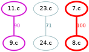
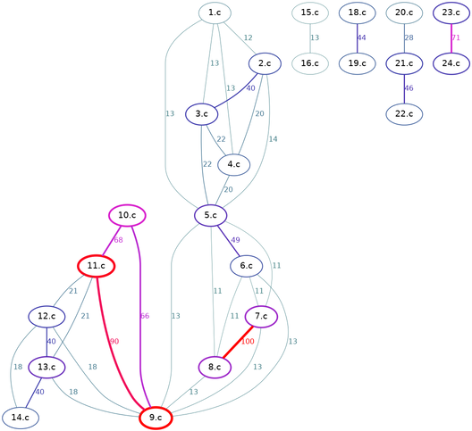
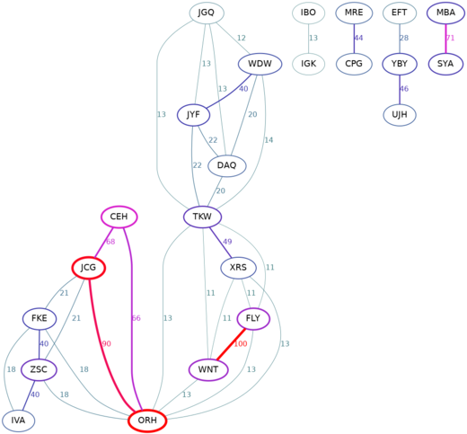
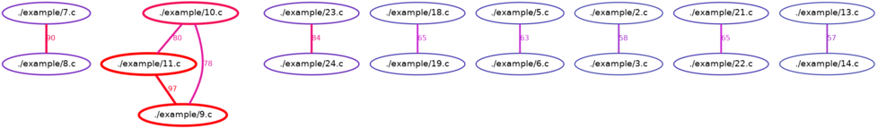
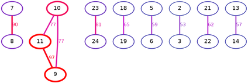
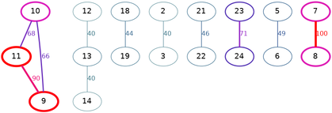
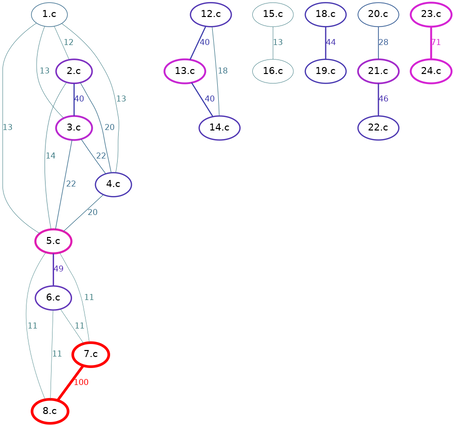
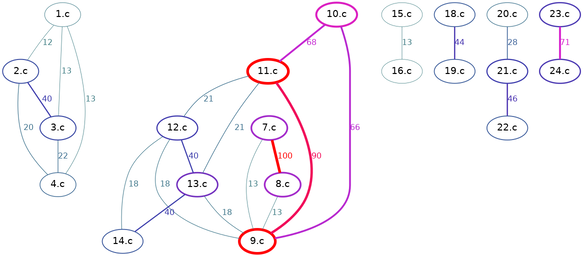

## Introduction

In this tutorial, we will be computing the similarity between the sorting programs featured in the article
[The tiniest C sort function?](https://www.cs.dartmouth.edu/~doug/tinysort.html). 
Let's assume that all of those programs are saved in the folder `./example/` under the names `1.c` ... `24.c`.

_(**!** Each command will be provided in two variants, as a full command and as its `./speck.rb` shorthand.)_

## Basics

To compute the similarity between files and render a diagram with the default threshold 0.7:

    ./scarlet.rb ./example/*.c | ./make-dot.rb | dot -Tpng -o out1.png
    ./speck.rb 's m dout1.png' ./example/*.c

We can see that, for example, programs `7.c` and `8.c` are identical (the latter is in fact the same s the former, but using single-letter variables).
After lowering the threshold to 0.1, we observe:

    ./scarlet.rb ./example/*.c | ./make-dot.rb 0.1 | dot -Tpng -o out2.png
    ./speck.rb 's m0.1 dout2.png' ./example/*.c

## Shortening filenames and anonymization 
    
By piping the output of `./scarlet.rb` through `./shorten.rb`, we remove common prefix and common suffix in the shown filenames:

    ./scarlet.rb ./example/*.c | ./shorten.rb | ./make-dot.rb 0.1 | dot -Tpng -o out3.png
    ./speck.rb 's h m0.1 dout3.png' ./example/*.c

(This command will produce the same diagram, but file extensions `.c` will be removed from all node labels.)

To anonymize the node labels, use `./anonymize.rb`:

    ./scarlet.rb ./example/*.c | ./anonymize.rb | ./make-dot.rb 0.1 | dot -Tpng -o out4.png
    ./speck.rb 's a m0.1 dout4.png' ./example/*.c

## Interoperability with MOSS

After running MOSS:

    moss.pl -l c -m 100 ./example/*.c

It command responds with an HTML report file (let's call it `moss.html`). This file can be used to generate the same diagrams as follows
(we read score from the column `6` and set the threshold to `0.0`, so that every pair reported by MOSS is shown):

    cat moss.html | ./table-from-moss.rb | ./make-dot.rb 0.0 6 | dot -Tpng -o out5.png
    cat moss.html | ./speck.rb 't m0.0,6 dout5.png'

Recall that the filenames can be automatically shortened:

    cat moss.html | ./table-from-moss.rb | ./shorten.rb | ./make-dot.rb 0.0 6 | dot -Tpng -o out6.png
    cat moss.html | ./speck.rb 't h m0.0,6 dout6.png'

Note that Scarlet shows an almost identical network structure if we raise its threshold to `0.35`:

    ./scarlet.rb ./example/*.c | ./shorten.rb | ./make-dot.rb 0.35 | dot -Tpng -o out7.png
    ./speck.rb 's h m0.35 dout7.png' ./example/*.c

## Filtering

Assume that program `10.c` is special, it was given to the students as an example, and some submitted it with no changes 
or with only minor inconsequential modifications. Then we would like to filter out all programs that resemble this example program. 

We can do so by removing `10.c` and all its neighbors (with the similarity score >= 0.6) with the following command:
   
    ./scarlet.rb ./example/*.c | ./filter.rb 10.c 0.6 | ./make-dot.rb 0.1 | dot -Tpng -o out8.png
    ./speck.rb 's f10.c,0.6 m0.1 dout8.png' ./example/*.c

As a result, programs `9.c`, `10.c`, and `11.c` got eliminated:

Note that `./filter.rb` is designed to look for the sprcified pattern (`10.c`), which does not have to be a full filename.
For example, we could use `10` instead, and it would still work exactly the same (as long as the pattern matches a unique filename):
    
    ./scarlet.rb ./example/*.c | ./filter.rb 10 0.6 | ./make-dot.rb 0.1 | dot -Tpng -o out8.png
    ./speck.rb 's f10,0.6 m0.1 dout8.png' ./example/*.c

The fact that we don't have to provide full filename can be convenient, but it can also become a problem if we need to eliminate
a program named, for example, `5.c`, since pattern `5.c` will be matched by two files: `5.c` and `15.c`. 

One solution is to replace `5.c` in the output table with a different name (e.g. `ABC.c`). Let's use `awk`:
    
    ./scarlet.rb ./example/*.c | awk '{sub(/\<5.c\>/, "ABC.c")}1' |./filter.rb ABC 0.4 | ./make-dot.rb 0.1 | dot -Tpng -o out9.png
    ./speck.rb 's' ./example/*.c | awk '{sub(/\<5.c\>/, "ABC.c")}1' | ./speck.rb 'fABC,0.4 m0.1 dout9.png'

or `sed` [(see StackOverflow explanation)](https://stackoverflow.com/questions/1032023/sed-whole-word-search-and-replace) to make such a substitution:

    ./scarlet.rb ./example/*.c | sed 's/\b5.c\b/ABC.c/g' |./filter.rb ABC 0.4 | ./make-dot.rb 0.1 | dot -Tpng -o out9.png
    ./speck.rb 's' ./example/*.c | sed 's/\b5.c\b/ABC.c/g' | ./speck.rb 'fABC,0.4 m0.1 dout9.png'

Since we chose filtering threshold `0.4`, two nodes, `5.c` and `6.c`, were removed. Also observe that node `15.c` was not affected.

